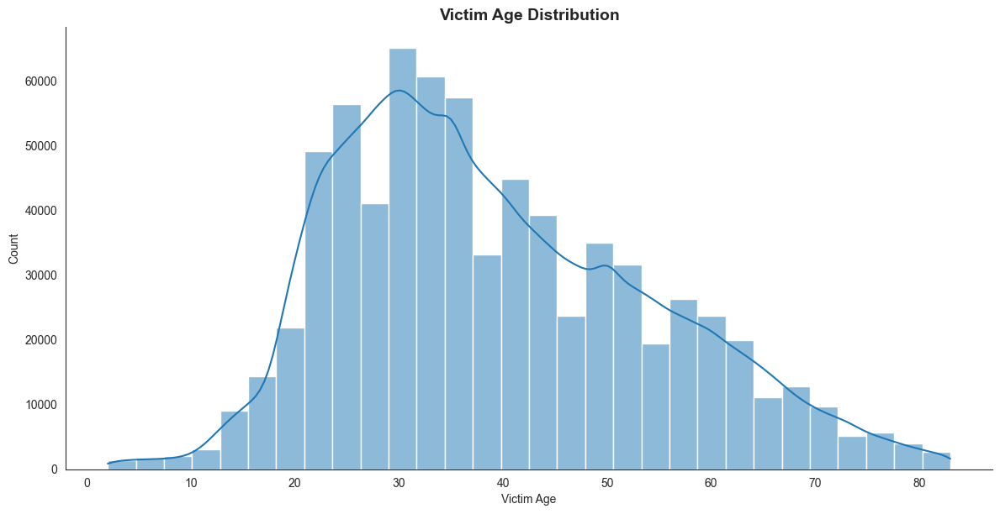
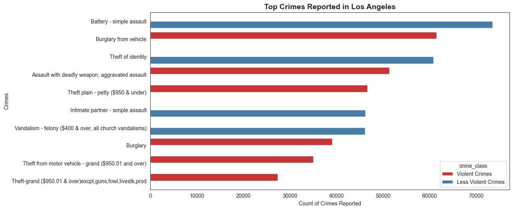
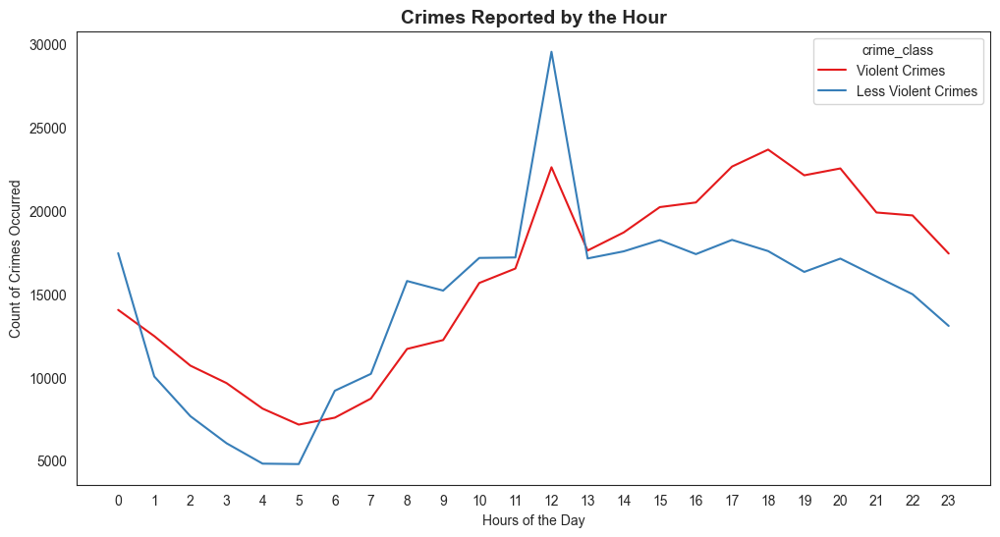
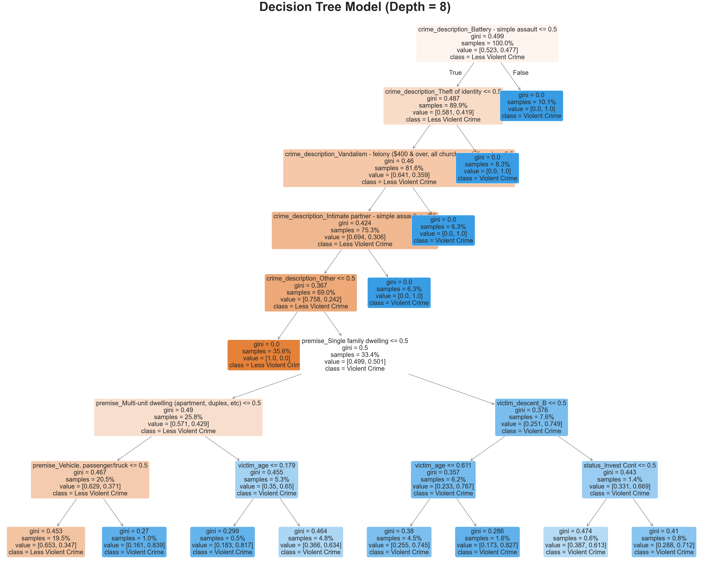
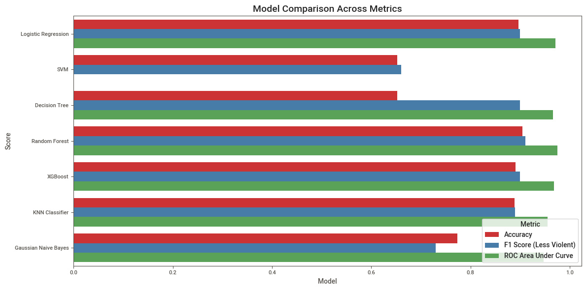

# Introduction
This project explores over five years of crime data reported by the Los Angeles Police Department (LAPD), spanning 2020 to 2025. By applying data cleaning, exploratory analysis, visualization, and machine learning techniques, the study seeks to uncover meaningful patterns in victim demographics, crime categories, geographic hotspots, and temporal trends. Beyond descriptive insights, the project also attempts to answer a key predictive question: Can victim and crime characteristics be used to determine whether an incident is violent or non-violent?

The broader aim is to demonstrate how data-driven methods can transform raw records into actionable knowledge—helping stakeholders allocate resources more effectively and opening discussions on how similar approaches could be applied in other contexts, including Bangladesh. The notebook can be found [here](/Notebook.ipynb).

*This project was part of my course requirement for **Business Analytics** (course code: K301) at the **Institute of Business Administration (IBA), University of Dhaka**. This readme markdown file is an condensed version of the report, which can be found [here](/Report.pdf).*

## Background 
The dataset used for the assignment is titled Crime Data from 2020 to Present, which was taken from the [official website](https://catalog.data.gov/dataset/crime-data-from-2020-to-present) for data of the US government. This dataset includes reported criminal events in Los Angeles from 2020 till March 2025. It is compiled from LAPD crime reports and includes data transcribed from paper records. To safeguard privacy of the victims, some location and address information as well as victim descent and gender have been cyphered or is missing. The dataset is part of the LAPD's transition to the FBI-mandated NIBRS system, and while it is accurate, minor errors may occur. It is a useful tool for analyzing crime trends in the city. The metadata for this dataset can be found [here](https://catalog.data.gov/harvest/object/aefb0682-9bda-4700-90ed-86bb20e210c6) and [here](/Metadata.json).

The dataset has a total of **1,004,991 rows** and **28 columns**. Not all of them are relevant for this assignment. Some of these columns were later dropped in the cleaning and modelling phase. Some rows were also removed for the same reason in the later phases. As the dataset CSV file size was enormous (255.5 MB), it was converted into parquet format (43.2 MB) for ease up computer memory and reduce time of execution. We store the dataset with the alias `crime`.

## Tools Used
For my deep dive into the crime data of Los Angeles, I harnessed the power of several key tools:
* **Python:** The core programming language powering my analysis, enabling flexible data manipulation and modeling.
* **`pandas`:** Essential for cleaning, transforming, and structuring the crime dataset.
* **`seaborn` & `matplotlib`:** My go-to libraries for creating clear, insightful, and visually engaging charts in Python.
* **`scikit-learn`:** The toolkit for building and evaluating machine learning models to classify and predict crime patterns.
* **Visual Studio Code:** My go-to for database management and executing SQL queries. 
* **Git & GitHub:** Essential for version control and sharing my SQL scripts and analysis, ensuring collaboration and project tracking.

In short, I leveraged python and some of its libraries (primarily `pandas`, `matplotlib`, `seaborn`, and `sckit-learn`) to conduct all my analysis.

# Data Cleaning & Pre-processing
Like almost all datasets, this dataset too was messy at the source. It needed substantial cleaning before conducting exploratory data analysis or running models. In the second stage of the assignment (the first stage being loading the dataset), we clean all the issues of the dataset and process the data as per our need. Here are the cleaning processes conducted step-by-step (more details in the report):
1. Dropping Irrelevant Columns
2. Renaming the Columns
3. Fixing the Variable Types
4. Changing Column Variables
5. Fixing the Missing Variables
6. Outlier Detection & Sanity Check

# Descriptive Statistics & Exploratory Data Analysis (EDA)
In this part of the report, we go through the finished the data and conduct various analyses. Exploratory Data Analysis (EDA) is a critical first step in data analysis where the goal is to explore and summarize the key characteristics of a dataset. Before jumping on to the exploratory data analysis, let us take a look at the first five rows of the clean data:

***Table 1.** First Five Rows of the Dataset*

| id        | date_reported | area        | crime_class          | crime_description                                | victim_age | victim_sex | victim_descent | premise               | status     | location            | date_time_occurrence |
|-----------|---------------|-------------|----------------------|-------------------------------------------------|------------|------------|----------------|-----------------------|------------|---------------------|----------------------|
| 211507896 | 11/04/2021    | N Hollywood | Less Violent Crimes  | Theft of identity                                | 31         | M          | H              | Single family dwelling | Invest Cont | 7800 beeman av      | 07/11/2020 08:45     |
| 201516622 | 21/10/2020    | N Hollywood | Violent Crimes       | Assault with deadly weapon, aggravated assault   | 32         | M          | H              | Sidewalk              | Invest Cont | Atoll av            | 18/10/2020 18:45     |
| 240913563 | 10/12/2024    | Van Nuys    | Less Violent Crimes  | Theft of identity                                | 30         | M          | W              | Single family dwelling | Invest Cont | 14600 sylvan st     | 30/10/2020 12:40     |
| 210704711 | 24/12/2020    | Wilshire    | Violent Crimes       | Theft from motor vehicle - grand ($950.01 and over) | 47      | F          | A              | Street                | Invest Cont | 6000 comey av       | 24/12/2020 13:10     |
| 201418201 | 03/10/2020    | Pacific     | Violent Crimes       | Theft from motor vehicle - petty ($950 & under) | 63         | M          | H              | Alley                 | Invest Cont | 4700 la villa marina | 29/09/2020 18:30     |

## Summary Statistics
The dataset had only a handful number of numeric columns. So, we determine the summary statistics for the numeric columns using `crime.describe().round(decimals = 3)`. The results of the summary statistics are presented in the table below:

***Table 2:** Summary Statistics*
| Statistic | victim_age | date_reported                | date_time_occurrence      |
|-----------|------------|------------------------------|---------------------------|
| ***count*** | 735631.000 | 735631                       | 735631                    |
| ***mean***  | 39.505     | 2022-05-01 06:39:55.425968128 | 2022-04-17 21:45:47.917638656 |
| **min**   | 2.000      | 2020-01-01 00:00:00          | 2020-01-01 00:01:00       |
| ***25*%**   | 28.000     | 2021-04-07 00:00:00          | 2021-03-21 23:30:00       |
| ***50*%**   | 37.000     | 2022-05-14 00:00:00          | 2022-04-29 19:20:00       |
| ***75*%**   | 50.000     | 2023-05-25 00:00:00          | 2023-05-11 16:12:30       |
| ***max***   | 99.000     | 2025-03-28 00:00:00          | 2025-03-26 06:33:00       |
| ***std***   | 15.571     | NaN                          | NaN                       |

From the table, we can find quite some findings about the numeric columns of the dataset. Some of the findings are:

1. **Victim Age:** The mean age of the victims is 39.505 years. The youngest age recorded is 2 years as all the ages below 0 including are dropped. The oldest age recorded is 99 years as all the ages above 100 including are dropped. So, the minimum and the maximum ages might not accurately represent the age of the victims. But the quantiles do. The interquartile range is between 28 years (25 percentile) and 50 years (75 percentile). Meaning, 50% of the victims' ages are between 28 and 50. The median age recorded is 37 which is close to our mean.
2. **Date Reported:** The earliest date when the crime was recorded is January 1, 2020 and the latest date is March 28, 2025. 50% of the crimes reported was between April 7, 2021 and May 25, 2023.
3. Date & Time Occurred: The earliest date-time when the crime took place is January 1, 2020 at 0100 hours and the latest date is Mach 26, 2025 at 0533 hours. 50% of the crimes reported was between March 21, 2021 at 2330 hours and November 11, 2023 at 1612 hours.

## Exploratory Data Analysis
We found a lot of things while going through the data. Some of the most crucial and interesting findings are shared below:

### Finding 1
The age of the victims is **right-tailed**, meaning the distribution is **positively-skewed**. But not by much. This analysis shows us that younger people were more prone towards victims of crimes in Los Angeles between 2020 and 2025.

***Figure 2:** The  Distribution of the Victims by Age.*

### Finding 2
The people of **H descents are the most victims of crimes-both violent and less violent**. Following them, are descents **W** and **B**. This finding is one of the most important findings as this will allow the police department allocate resources meaningfully. This insight will allow them to focus more on people of this descent and ensure their safety and protection.

***Figure 3:** The Distribution of the victims by descent.*

### Finding 3
As per the data, **Males are the most victims of violent crimes** whereas **Females are the most victim of less violent crimes**. The other sexes recorded also faced crimes, but those records were not significant compared to the ones of men and women. Now this can also mean that females are not reporting the crimes happened to them. Without statistical tests, this cannot be verified. Overall, males face the most violence.

***Figure 4:** The Distribution of the Victims by Sex.*

### Finding 4
This finding is also a very crucial one. As per the data, the most recorded less violent crime is **Battery-simple assault**. At the same time, the most recorded violent crime is **Burglary from vehicles**. This finding is crucial because it will allow responders to prepare accordingly before handling any situations. The police force can train their officers to respond appropriately to these crimes. The other most common less violent crimes are **Theft of identity**, **Intimate partner simple assault**, etc. The other common violent crimes are **Assault with deadly weapon**, **aggravated assault**, **Theft plain-petty ($950 & under)**, etc.

***Figure 5:** The Distribution of the Victims by Crime Type.*

### Finding 5
Another important insight-we identified the top crime-prone areas of Los Angeles. As per the data, **Central had the most reported violent crimes** whereas **77th Street had the highest less violent crimes**. This insight will allow the police departments to prepare and respond to these areas appropriately. They can prepare backups ready for crime calls from such area. Other common areas include **Pacific**, **Southwest**, **Hollywood**, etc.

***Figure 6:** The Most Crime Prone Areas in Los Angeles.*

### Finding 6
Now, we take a look at the crimes' status from the LAPD's side. As can be shown from the graph below, **a huge number of crimes are still under investigation**. Compared to the number of active investigations, the number of arrests and other methods are very few. Now it is understandable that at the same time, a lot of crimes will be under investigation. But this insight will allow the police departments to streamline their investigation process by means of either higher resource allocation or other measures deemed appropriate.

***Figure 7:** The Crime Status from LAPD's Side.*

### Finding 7
Premises tell us about the contextual environment of the data— the setting in which the crime took place. From the graph we can see that, **a huge number of less violent crimes took place in single family dwelling** whereas **a high number of violent crimes took place in the streets**. Premises add critical context about the crime setting. LAPD can develop countermeasures from this insight.

***Figure 8:** The Distribution of the Victims by Premises.*

### Finding 8
Now, we get into some time-series analysis. As per the data, **the highest number of crimes occurred at 1200 hours (12:00 PM)** and **the lowest number of crimes took place at 0500 hours (05:00 AM)**. This data will help police departments re-organize their schedules and assign more patrol at the high crime-hours.

***Figure 9:** The Time Series Analysis of Crimes.*

### Finding 9
When we analyzed the data based on the days of the weak and the months of the year, we saw that almost all the days or months had roughly the same number of crimes reported. So, no insights could be produced from here. Crime doesn't vary on the large scale when thinking of days or months. The number of crimes across hours and days can be visualised via the following heatmap:

***Figure 10:** Heatmap of Crimes by Days and Hours.*

The number of crimes across days and months can also be visualised via the following heatmap:

***Figure 11:** Heatmap of Crimes by Months and Days.*

### Finding 10
Finding 10: For our last finding, we tracked the crime count over the years (2020-2025). As per the data, **the number of crimes appeared to go down**. But that is not the case. As per the data source:

> The LAPD implemented a new Records Management System for reporting arrests anc rimes on March 7, 2024. The FBI's mission to collect NIBRS-only data is being mei by the implementation of this new system. Users will only be able to view incidents that have been reported in the retiring system during this transition. 

So. this explains the below graph that the amount of crime seems to go down.

***Figure 12:** The Crime Count Over the Years.*

# Modelling & Performance Comparison
Before entering the final phase of the assignment-machine learning modelling— we need to modify our dataset once again to fit the models.

## Data Preparation for Modelling
1. Dropped the unnecessary columns like ID, date & time settings, and locations.
2. As the premise and crime description columns had a lot of values, we keep only the first 10 values of each column because the first 10 values of premise make up around 79% of all the values and the first 10 crime descriptions make up around 67%. We convert the rest of the values to "`Other`" crimes.
3. We scale the "`victim_age`" column using MinMax Scaling. Then we dummy encode the whole dataset.
4. We separate the target and independent variables into `y` and `X` respectively.
5. Lastly, we conduct a train-test split at the 70:30 ratio with stratification enabled for a proportionate distribution of the independent and target variables.

## Machine Learning Modelling
From analyzing the dataset, we came across a question that can help the police department-***Can the crime & victim characteristics predict whether a crime is less or more violent?*** It is a binary question which can be answered using the classification models. 

In this section, we take a look at the models used. The performance of the models and the best model will be discussed in the next section.

### Logistic Regression
Logistic regression model, it predicts the likelihood of a yes or no outcome based on the input features, which in our case, is whether a crime is less violent or not. It then classifies the result based on whether the likelihood exceeds a certain threshold. For our model, we selected `solver = "newton-cholesky"` and kept the maximum iterations to 1000 to reserve computing power. 

### Support Vector Machine (SVM)
SVM finds the best decision hyperplane that maximizes its separation from the support vectors-the nearest data points from each class. It establishes the broadest "margin" or buffer zone between classes to guarantee the strongest possible separation. We also limited the maximum iterations to 2000 because without it, the model runs forever. No ROC curve could be produced because of two `AttributeErrors`. 

### Decision Tree Classifier
A decision tree is similar to a yes/no flowchart, with data separated at each step based on feature values. It asks questions like, *Is the victim over 30?* and *Is sex = H?* until it reaches a final categorization at the leaf nodes where Gini Impurity is 0. We kept the `max_depth = 8` for computation purposes. Tree diagram shown below:

***Figure 13:** Decision Tree Diagram (depth 8)*

### Random Forest Classifier
Random forest is the next step of a decision tree. It generates hundreds of distinct decision trees using random subsets of data and features, then uses a majority vote from all trees. It's like asking 1000 different experts (trees) for their thoughts and going with whatever the majority decides. The final class is determined by a majority vote among all trees, boosting stability and accuracy. We kept `max_depth = 25` and `n_estimators = 500` for computational purposes.

### Extreme Gradient Boosting (XGBoost) Classifier
XGBoost is an ensemble learning method that builds multiple decision trees sequentially, where each new tree tries to correct the errors of the previous ones. It combines these trees’ predictions using a weighted sum to produce highly accurate classifications. For our model, we set `n_estimators = 1000`, `max_depth = 50` and `learning_rate = 0.1` to balance performance and computation, while using `eval_metric = "logloss"` to monitor training progress.

## Performance Evaluation

### Summary of the Model Performances
The findings of the above graph are visualized across accuracy, ROC AUC, F1 Score (less violent), and RMSE in the next page as well as the ROC curves of three models (SVM required additional steps).

***Table 3:** Model Performance*
| Metric                        | Logistic Regression | Support Vector Machine (SVM) | Decision Tree Classifier | Random Forest Classifier | Extreme Gradient Boosting (XGBoost) Classifier |
|-------------------------------|-------------------|-----------------------------|------------------------|------------------------|-----------------------------------------------|
| ***Accuracy***                      | 0.896             | 0.652                       | 0.893                  | 0.904                  | 0.891                                         |
| ***ROC AUC***                       | 0.971             | 0.44                        | 0.966                  | 0.975                  | 0.968                                         |
| ***Precision (Less Violent)***      | 0.89              | 0.47                        | 0.88                   | 0.9                    | 0.89                                          |
| ***Precision (Violent)***           | 0.9               | 0.07                        | 0.91                   | 0.91                   | 0.89                                          |
| ***Recall (Less Violent)***         | 0.91              | 0.9                         | 0.92                   | 0.92                   | 0.90                                          |
| ***Recall (Violent)***              | 0.88              | 0.12                        | 0.86                   | 0.89                   | 0.88                                          |
| ***F1 Score (Less Violent)***       | 0.9               | 0.62                        | 0.9                    | 0.91                   | 0.90                                          |
| ***F1 Score (Violent)***            | 0.89              | 0.59                        | 0.88                   | 0.90                   | 0.89                                          |
| RMSE                           | 0.322             | -                           | 0.328                  | 0.31                   | 0.331                                         |

As can be seen from the table and the graph, the **Random Forest Classifier** model scored excellent in all the metrics— high scores in accuracy, area under the ROC curve, precision, recall, etc. and scored lowest in RMSE (low scores mean a better model). The **Support Vector Machine** (SVM) model scored the lowest in all metrics except recall (violent). So, the best model for this problem is **Random Forest Classifier**.

***Figure 14**: Model Performance across Four Metrics*

The Random Forest model (maximum depth = 25, 500 trees) demonstrates excellent performance in classifying crimes. For class 0 (less violent crimes), it achieved a **precision of 0.90** and **recall of 0.92**, indicating that most predicted class 0 cases were correct and that the model successfully identified the majority of actual class 0 instances. For class 1 (violent crimes), the model attained a **precision of 0.91** and **recall of 0.89**, showing high correctness of predicted class 1 cases while capturing a substantial portion of actual class 1 instances. Lastly, the model achieved an F1-score of 0.91 for class 0 and 0.90 or class 1, demonstrating robust overall classification performance across both crime classes. 

Overall, the random forest model achieved an accuracy of 90.41%, correctly classifying nearly 9 out of 10 cases. Its **ROC AUC of 97.5%** indicates excellent ability to discriminate between the two crime classes (violent and less violent). The model's **RMSE of 0.31** reflects a relatively low prediction error, further supporting its reliability of distinguishing between violent and less violent crimes.

***Figure 15**: ROC Curves of Three Models*

# Conclusion
## Reflection on the Project 
The whole project was one of the most critical, thoughtful, and impactful ones. The whole process helped in teaching how to read between the lines of data, utilize Al tools as a helping method rather than fully depending on it, generate meaningful insights which can later lead to data-driven decision makings, polish messy data, generate models which can predict outcomes, conduct sanity checks, and so on. Overall, this project will benefit in the future data problems and roles significantly. 

## Bangladeshi Context & Benefits
Such dataset and insights could be extremely helpful for Bangladeshi law enforcement agencies. The way the data is collected and analyzed to find patterns can teach our law enforcement to utilize data and take critical data-driven decisions. Overall, the work has critical importance in Bangladeshi context.